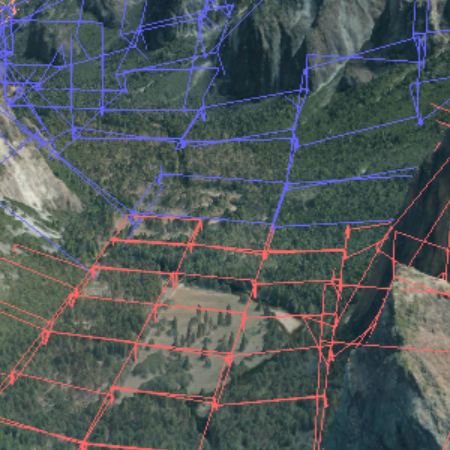

# dito.ts

Javascript implementation of the DiTO OBB construction method "[Fast Computation of Tight-Fitting Oriented Bounding
Boxes](http://www.idt.mdh.se/~tla/publ/FastOBBs.pdf)" of the book "Game Engine Gems 2", based on the provided [C++
sample implementation](http://gameenginegems.com/geg2.php).

[Yosemite Valley](http://www.arcgis.com/home/item.html?id=1f97ba887fd4436c8b17a14d83584611) by [VRICON](https://www.vricon.com/) | [Terms of use](http://www.arcgis.com/home/item.html?id=5618776e04be41a68b349b8751a9cdb6)

## Issues

Find a bug or want to request a new feature? Please let us know by submitting an issue.

## Contributing

Esri welcomes contributions from anyone and everyone. Please see our [guidelines for contributing](https://github.com/esri/contributing).

## Licensing

Copyright 2018 Esri.
Copyright 2011 Thomas Larsson and Linus Kallberg (C++ implementation).

Licensed under the BSD 2-clause License,
you may not use this file except in compliance with the License.

Unless required by applicable law or agreed to in writing, software
distributed under the License is distributed on an "AS IS" BASIS,
WITHOUT WARRANTIES OR CONDITIONS OF ANY KIND, either express or implied.
See the License for the specific language governing permissions and
limitations under the License.

A copy of the license is available in the repository's [LICENSE](https://raw.github.com/Esri/dito.ts/master/LICENSE) file.
